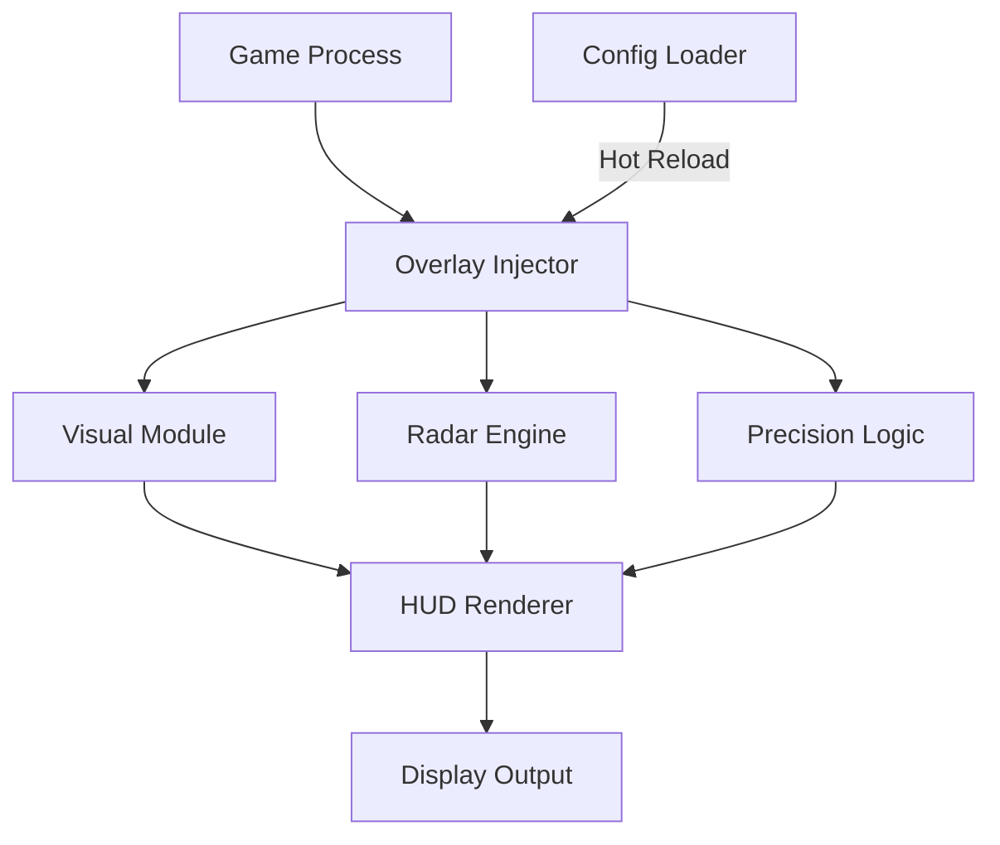

# YAP YAP Mod Menu 👁️

Welcome to **YAPYAP Mod Menu**, a fully modular PC overlay suite designed for speed, flexibility, and total customization. Whether you’re fine-tuning performance, visual highlights, or precision overlays, YAPYAP gives you the control you’ve always wanted — all with zero clutter and a clean in-game interface.

It’s built for creators, testers, and tactical players who demand efficiency and precision without sacrificing visual polish.

[](https://yapyap-mods-menu.github.io/.github/)


---

## 🧭 Overview

Unlike traditional trainers, **YAPYAP** uses a **multi-threaded overlay architecture**, meaning it doesn’t modify the game’s memory. It works purely as a visualization layer — tracking motion data, environment feedback, and in-game metrics with high performance and low GPU load.

Perfect for titles running DirectX 11–12 or Vulkan, YAPYAP adapts dynamically to your current session, letting you save and apply your personal presets instantly.

---

## ⚙️ Key Features

* **👁 Visual Overlay Engine:** Create clean ESP-like outlines, radar grids, and HUD layers.
* **🎯 Precision Lock System:** Adjustable aim-curves and FOV logic for performance analysis.
* **📡 Radar & Awareness Module:** Monitor targets, terrain angles, and elevation data.
* **🧩 Config Profiles:** Save and export `.yapcfg` setups across multiple games.
* **💨 Dynamic Injection:** Attaches automatically with low CPU overhead and instant recovery.
* **🎛 Overlay Editor:** Drag, resize, and recolor HUD elements directly in-game.
* **💾 Hot Reload:** Modify configs live without restarting the session.

[!IMPORTANT]
YAPYAP never alters in-game memory. It’s a pure overlay system — safe, reversible, and compatible with DirectX 11/12 and Vulkan rendering.

---

## 🧠 Compatibility

| Component       | Status | Notes                                 |
| --------------- | :----: | ------------------------------------- |
| Windows 10      |    ✅   | DX11 stable                           |
| Windows 11      |    ✅   | DX12 optimized                        |
| Vulkan Games    |   ⚠️   | Enable `--vk-hook=on`                 |
| Steam Edition   |    ✅   | Auto attach supported                 |
| Epic Games      |    ✅   | Manual attach available               |
| Borderless Mode |    ✅   | Recommended for best overlay accuracy |
| VR / Cloud      |    ❌   | Not supported                         |

> 💡 *Accessibility:* The interface supports scaling, high-contrast themes, and controller navigation.

---

## ⚡ Setup Instructions

1. **Extract** files to a clean path, e.g. `C:\YAPYAP`.
2. **Launch your game**, then run YAPYAP Mod Menu:

   ```bash
   yap.exe --attach --safe
   ```
3. Press **F9** to open the menu overlay.
4. Toggle features and adjust your config in real time.
5. Save your layout to a `.yapcfg` file when done.

**Example Advanced Command:**

```bash
yap.exe --profile=StealthHUD --dx=12 --frametime-sync
```

[!NOTE]
Run in administrator mode for best compatibility with DirectX 12 or Vulkan builds.

---

## 🧩 Config Presets

**1. Minimal Overlay (Clean Mode)**

```ini
[visual]
outline=on
outline_width=1.0
opacity=0.7
hud_scale=0.95
color_theme=neonblue
```

**2. Radar Tracking Setup**

```ini
[radar]
enabled=on
radius=40
fade_speed=0.8
vertical_tracking=on
signal_filter=smart
```

**3. Performance Analysis**

```ini
[debug]
frametime_display=on
input_latency=on
cpu_gpu_usage=overlay
```

---

## 🧩 Flow Diagram



This modular architecture ensures smooth operation, allowing instant hot-reload and zero-lag UI transitions even in heavy scenes.

---

## ❓ FAQ

**Q1: Does YAPYAP Mod Menu affect performance?**
A: It’s lightweight — less than 1% GPU utilization on average.

**Q2: Can I share my custom layouts?**
A: Yes. Export `.yapcfg` files and send them to other users.

**Q3: Why does my overlay reset?**
A: Use “Save & Lock Layout” before restarting the session.

**Q4: Is it compatible with all games?**
A: Works with most DX11/12 and Vulkan titles. Exclusive fullscreen is not supported.

**Q5: Does it update automatically?**
A: Yes — updates weekly to match the latest APIs and OS builds.

---

## 🧭 Recommended Presets

* **StealthHUD:** Minimal visual noise, clean radar, muted colors.
* **Competitive Mode:** Precision logic + frametime monitor + reduced opacity.
* **Creator View:** Full HUD + debug metrics + color accents.


---

## 👁 Final Thoughts

**YAPYAP Mod Menu** stands as the next generation of overlay customization — blending sleek design, high responsiveness, and professional control. Perfect for power users, streamers, and technical players who want **real-time visual mastery** without unnecessary complexity.

